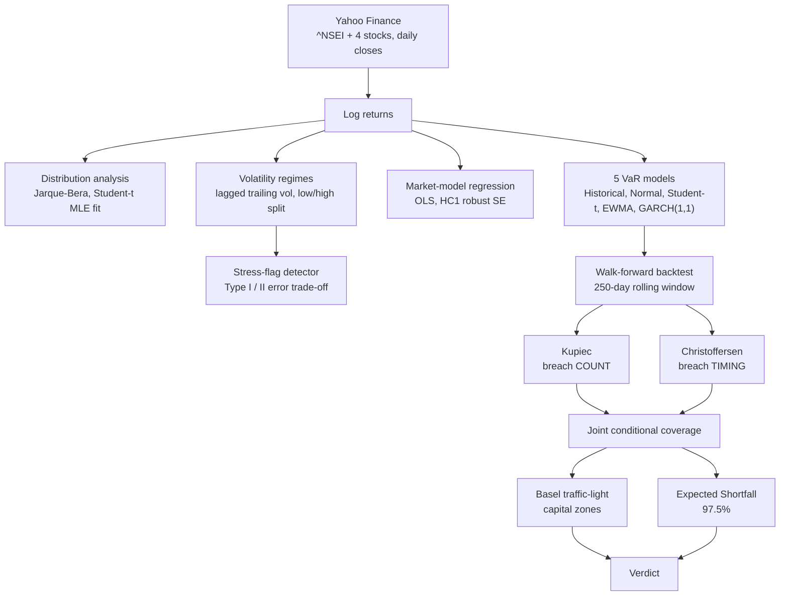

# Market Risk Statistical Validation Framework

**Do the standard Value-at-Risk models actually hold up out of sample?
A classical-statistics audit on NIFTY 50.**

`Python` `NumPy` `pandas` `SciPy` `statsmodels` `arch` `Matplotlib` `Streamlit`

---

> **In one line:** Five VaR models are walked forward, one unseen day at a
> time, through the same regulatory backtesting battery a bank would use —
> and the project's central finding is that passing on breach *count* and
> passing on breach *timing* are different questions, one of which most
> validation write-ups never ask.

## Contents

1. [Why](#why) — the problem with most VaR write-ups
2. [What](#what) — scope, models, and tests at a glance
3. [How it works](#how-it-works) — pipeline and methodology
4. [Outcome](#outcome--headline-findings) — the 9 findings
5. [Dashboard](#dashboard)
6. [Project structure](#project-structure)
7. [Verification](#verification) — what's tested, what isn't
8. [Reproducing this](#reproducing-this)
9. [Scope and honest limitations](#scope-and-honest-limitations)
10. [Key design principle](#key-design-principle)

---

## Why

Most VaR write-ups stop at *computing* a number. That's the easy half. The
question a risk function is actually asked is **"can we rely on this
number?"** — a hypothesis-testing problem, not an estimation problem. Three
things specifically shaped this project's design:

| Design pressure | What it means in practice |
|---|---|
| **A single p-value hides the failure that matters.** | A model can breach exactly 5% of the time and still be dangerous if every breach lands in the same fortnight. Kupiec sees only the count — only the independence test sees the clustering. Both are reported, and the verdict follows the joint test, not either half alone. |
| **Look-ahead bias is silent, and it makes results look *better*.** | Labelling a day "high volatility" from a window that includes that day's own return manufactures statistical significance. On i.i.d. noise with a known true variance ratio of 1.0, the leaky version rejects equal variance anyway. That one `.shift(1)` fix is the most consequential line in the repository. |
| **Basel moved on, so the project should too.** | FRTB replaced 99% VaR with 97.5% Expected Shortfall because VaR says nothing about breach severity and isn't sub-additive. A statistical verdict also isn't what a bank acts on — it acts on a capital multiplier, which is what the Basel traffic-light section translates the backtest into. |

Deliberately classical throughout — distributions, maximum likelihood,
hypothesis tests, OLS with heteroskedasticity-robust errors, likelihood-ratio
backtests. GARCH(1,1) sits on the same side of that line as everything else:
a fully specified likelihood fit by MLE, with two estimated parameters
(persistence and reaction) where EWMA has one assumed one (a fixed decay).
**No machine learning anywhere** — the point is inference, not prediction.

---

## What

| | |
|---|---|
| **Market** | NIFTY 50 (`^NSEI`) + RELIANCE, TCS, HDFCBANK, INFY |
| **Period** | 2019-01-01 to 2024-12-31 (requested range — see [live-data note](#reproducing-this)) |
| **VaR models** | Historical · Parametric Normal · Parametric Student-t · EWMA (λ=0.94) · GARCH(1,1) |
| **Confidence levels** | 90% / 95% / 99% VaR, 97.5% Expected Shortfall |
| **Backtest window** | 250-day walk-forward, out of sample |
| **Extras** | Basel traffic-light capital zones, HC1-robust market-model regression |

**The test battery**, applied to every model:

| Test | Question | Distribution |
|---|---|---|
| Kupiec (1995) Proportion-of-Failures | Did the model breach the right **number** of times? | χ²(1) |
| Christoffersen (1998) independence | Did breaches arrive at independent **times**, or in bursts? | χ²(1) |
| Christoffersen joint conditional coverage | Both together — the test a model must survive to be usable | χ²(2) |

Every estimate is walk-forward out of sample: VaR for day *t* is fitted on
days *t−250 … t−1* and tested against day *t*. Nothing that describes day
*t* has seen day *t*.

---

## How it works



Each stage answers the question the previous stage raised — the full
reasoning chain (why distribution analysis comes before regimes, why regimes
come before a real-time detector, and so on) is walked through narratively
in `main.ipynb` and the dashboard's chapters.

**Methodology, by component:**

| Component | Detail |
|---|---|
| **Volatility regimes** | 21-day trailing realised volatility, split at its median, **lagged one day** so a day's label uses only information available at its open. `classify_regime(..., ex_ante=False)` reproduces the biased version for comparison. |
| **Market model** | `R_i = α + β·R_m + ε`, OLS with **HC1** robust standard errors (needed because daily equity returns exhibit volatility clustering, which violates classical OLS's constant-variance assumption). This is the market model, not CAPM — no risk-free rate is subtracted and no equilibrium claim is made. |
| **VaR** | Historical (empirical quantile), Parametric Normal, Parametric Student-t (MLE location–scale fit), EWMA (λ=0.94), GARCH(1,1) (Normal innovations, MLE via `arch`, one-step-ahead variance forecast). GARCH is detected at import time (`risk_utils.GARCH_AVAILABLE`) — if `arch` isn't installed, `VAR_METHODS` simply omits `"garch"` and every loop over it runs the other four models without crashing. |
| **Backtests** | Kupiec POF, Christoffersen independence (first-order Markov chain on the breach indicator), joint conditional coverage via `LR_CC = LR_POF + LR_IND ~ χ²(2)`. Log-likelihoods use `scipy.special.xlogy` so 0·log(0) boundary cases resolve to their limits instead of `nan`. |
| **Basel traffic-light zones** | `basel_traffic_light()` maps a 99% VaR exception count onto Basel's official green (0–4) / yellow (5–9) / red (10+) zones and capital-multiplier add-on (base k=3.00). Officially defined for a 250-trading-day window; this project's out-of-sample window is longer, so the function scales the boundaries proportionally and explicitly flags the result as an approximation. |
| **Expected Shortfall** | Historical, Normal closed-form, and Student-t closed-form at 97.5%, reported with the ES/VaR ratio as a tail-heaviness diagnostic. Student-t ES returns `nan` when fitted degrees of freedom ≤ 1, since the conditional mean doesn't exist there. |

---

## Outcome — headline findings

Numbers come from a full run of `main.ipynb` / `app.py` at default settings
(250-day window, 95% VaR / 97.5% ES) and are reproducible by re-running
either — both import the same `risk_utils.py` functions, so a figure can't
differ between the notebook and the dashboard. There is no separate results
file; the notebook itself is the record.

| # | Finding |
|---|---|
| 1 | Kupiec is necessary but not sufficient — a model can pass the breach-**count** test and still fail on breach-**timing** clustering |
| 2 | Look-ahead bias fabricates statistical significance from pure noise (shown on synthetic i.i.d. data with a known-true variance ratio) |
| 3 | VaR calibration does not transfer across confidence levels — passing at 95% says nothing about 99% |
| 4 | Risk lives in the second moment — regimes differ in variance, not mean return |
| 5 | Returns are decisively non-Normal, confirmed two independent ways (distribution shape and ES/VaR ratio) |
| 6 | A one-day return threshold is a weak, low-recall proxy for a volatility regime |
| 7 | Beta is not total risk — systematic exposure varies materially across the 4 stocks |
| 8 | Estimating volatility persistence (GARCH) did not beat assuming it (EWMA), on this data |
| 9 | Basel's traffic-light zone and the independence test can disagree — the zone only counts breaches, never their timing |

<details>
<summary><b>1 — Kupiec is necessary but not sufficient</b> (click to expand)</summary>
<br>

This is the project's central result. At least one model at each confidence
level passes the proportion-of-failures test and is then rejected by the
independence test: the breach *count* is right while the breach *timing* is
clustered. Clustered breaches are the failure mode that turns a limit excess
into a capital event. A validation report that stops at Kupiec can sign off
a model that was wrong for two straight weeks.
</details>

<details>
<summary><b>2 — Look-ahead bias fabricates significance from pure noise</b></summary>
<br>

On synthetic i.i.d. Normal returns, where the true high-vol/low-vol variance
ratio is exactly 1.0 by construction, the naive rolling-window labelling
reports a ratio well above 1 and rejects equal variance. The ex-ante
labelling recovers ≈1.0 and correctly fails to reject. The regime effect on
real NIFTY data is genuine — but the naive implementation could not have
established that, because it rejects on random numbers too.
</details>

<details>
<summary><b>3 — VaR calibration does not transfer across confidence levels</b></summary>
<br>

Models that pass Kupiec at 95% fail at 99%. A validation performed at one
level says nothing about another, which is a direct argument against the
common practice of validating once and reporting everywhere.
</details>

<details>
<summary><b>4 — Risk lives in the second moment</b></summary>
<br>

Mean return is statistically indistinguishable between low- and
high-volatility regimes (Welch's t-test, Mann-Whitney U); variance is
decisively different (Levene / Brown-Forsythe). "High volatility" does not
mean "the market is falling" — it means outcomes are more uncertain in both
directions.
</details>

<details>
<summary><b>5 — Returns are decisively non-Normal, confirmed two independent ways</b></summary>
<br>

Jarque-Bera rejects Normality at any conventional level (fat tails, negative
skew), and the measured ES/VaR ratio exceeds the Normal benchmark at every
confidence level — the same conclusion reached from the loss side rather
than the moment side.
</details>

<details>
<summary><b>6 — A one-day return threshold is a weak proxy for a volatility regime</b></summary>
<br>

Tightening the stress-flag percentile trades recall away far faster than it
buys precision. A point detector cannot identify a state, which is the
argument for volatility-reactive models (EWMA, and GARCH(1,1) alongside it)
over a point-in-time rule.
</details>

<details>
<summary><b>7 — Beta is not total risk</b></summary>
<br>

Systematic exposure varies materially across the four stocks, with TCS and
INFY statistically below the market. HC1 heteroskedasticity-robust standard
errors were used because return residuals are conditionally heteroskedastic
by construction; classical OLS errors overstate the precision of every one
of these betas.
</details>

<details>
<summary><b>8 — Estimating persistence (GARCH) did not beat assuming it (EWMA), on this data</b></summary>
<br>

At the default settings, Historical, Normal Parametric, EWMA and GARCH(1,1)
all survive the full battery; only Student-t Parametric is rejected,
specifically for clustered breach timing. GARCH's maximum-likelihood
persistence estimate was not necessary to fix the clustering problem here —
a fixed conventional decay already worked, which is itself a useful
(negative) result about when the extra estimation earns its keep.
</details>

<details>
<summary><b>9 — The Basel traffic-light zone and the independence test can disagree</b></summary>
<br>

Scaled to this project's out-of-sample window, every model lands in Basel's
red zone by exception count alone — including models the independence test
says are fine. The zone only counts whether there were too many breaches,
never whether their timing was random, which is exactly the blind spot the
rest of this project is built to expose.
</details>

---

## Dashboard

`streamlit run app.py` — an 8-chapter guided narrative, read in order via
Next/Previous or jumped to directly from the sidebar's Story list. Every
chapter states its question before its answer, and the Executive Summary
and Verdict chapters are computed live from whatever data is actually
loaded, not fixed text.

| Chapter | Question it answers |
|---|---|
| 0 · Executive Summary | Can we actually trust a VaR model, or only its headline number? |
| 1 · Distribution | Every parametric VaR model assumes a distribution — is that assumption even true? |
| 2 · Volatility Regimes | If volatility comes in regimes, is a single "average" risk number already misleading? |
| 3 · Systematic Risk | How much of a stock's risk is the market's risk, and how confidently can we say so? |
| 4 · Real-Time Detection | Could a cheap, live rule substitute for a regime that's only knowable in hindsight? |
| 5 · Estimating the Loss | Different distribution/volatility assumptions produce different VaR numbers — by how much? |
| 6 · Out-of-Sample Validation | Did the models actually hold up when walked forward, day by day? |
| 7 · The Verdict | What survived, and what does it mean? |

Downloads price data live from Yahoo Finance on each run.

---

## Project structure

```
Market Risk Statistical Validation Framework/
├── risk_utils.py           # the engine: all statistics, VaR, ES and backtests
├── main.ipynb              # analysis narrative, 13 sections with observations
├── app.py                  # Streamlit dashboard over the same engine
├── style.css               # dashboard styling
└── requirements.txt
```

| File | Purpose |
|---|---|
| `risk_utils.py` | Single source of truth for every statistic — imported by both the notebook and the dashboard, so a number can't drift between the two |
| `main.ipynb` | The narrative: 13 sections, each stating a question, running the test, and recording an observation/conclusion |
| `app.py` | The same engine, presented as an interactive 8-chapter dashboard |
| `style.css` | Dashboard styling |
| `requirements.txt` | Pinned runtime dependencies |

Five files, one job each.

---

## Verification

There is no automated test suite in this project (no `pytest`, no `tests/`
folder) — worth saying plainly rather than leaving it implied.

| What exists | What doesn't (yet) |
|---|---|
| **One engine, two consumers** — `main.ipynb` and `app.py` both import their statistics from `risk_utils.py` rather than reimplementing anything, so a number can't quietly drift between the two | An automated `pytest` suite covering `risk_utils.py`'s closed-form functions against independent recomputation |
| **The look-ahead demonstration is itself a verification exercise** — Section 3 runs naive and ex-ante labelling on synthetic i.i.d. data where the true answer is known in advance, and shows the naive version gets it wrong. Same logic a unit test would use, just run inline rather than pinned as a regression | The look-ahead and breach-clustering findings pinned as automated regression tests so they can't silently break |

Framed here as planned, not implied to already exist.

---

## Reproducing this

```bash
pip install -r requirements.txt          # runtime (dashboard + engine, incl. `arch` for GARCH)

streamlit run app.py                     # interactive dashboard
jupyter notebook main.ipynb              # full analysis narrative
```

**Live-data note:** both pull price data live from Yahoo Finance on every
run — there is no committed data snapshot in this repo, so each run needs
an internet connection and reflects whatever Yahoo Finance returns at that
moment. Results can drift slightly run to run as more recent trading days
become available, rather than being pinned to a fixed historical window.

The GARCH cells (notebook Section 8b, and the equivalent dashboard backtest)
refit a maximum-likelihood optimisation on every rolling window and are
noticeably slower than the rest of the notebook to execute — expect the
first run to take longer, not to fail.

---

## Scope and honest limitations

| Limitation | Why it's there |
|---|---|
| One market, one asset class, ~6 years | A single COVID-scale shock dominates the tail, so tail conclusions rest on few effective observations. Extending to a structurally different crisis (2008 GFC, 2013 taper tantrum) is a natural next step — the date range is a configurable constant, but has not been run with a longer window in this revision |
| Low test power at 99% | Expected breach count over this sample is ~12, so the Christoffersen tests have low power there. Failing to reject is not evidence of adequacy, and the notebook says so rather than claiming a pass |
| GARCH uses Normal innovations | A Student-t innovation (combining the fat-tail finding with GARCH's persistence estimate) is the natural next refinement, not implemented here |
| Basel zones are a scaled approximation | The official table is defined for a 250-day window; this project's out-of-sample window is longer, so boundaries are scaled proportionally and explicitly flagged as an approximation |
| VaR is one-day, unscaled | The √h scaling rule assumes i.i.d. returns, which the volatility-clustering result shows is false, so multi-day figures were deliberately not reported |
| Regime classification is a median split | Transparent and testable, but cruder than a Markov-switching model |
| Equity only | No fixed income, FX, options, or portfolio-level VaR aggregation — where VaR's failure of sub-additivity would bite hardest |

---

## Key design principle

> The interesting question about a risk model is never "what number does it
> produce" but **"under what conditions does it fail, and would my
> validation have caught it?"**

Two failures in this project were invisible in the model output and visible
only under a properly specified test: a look-ahead leak that *improved* the
reported p-value, and a VaR model with a correct breach count and
dangerously clustered breach timing. Both were found by the test, not by
the eye — which is the entire case for building the test.
